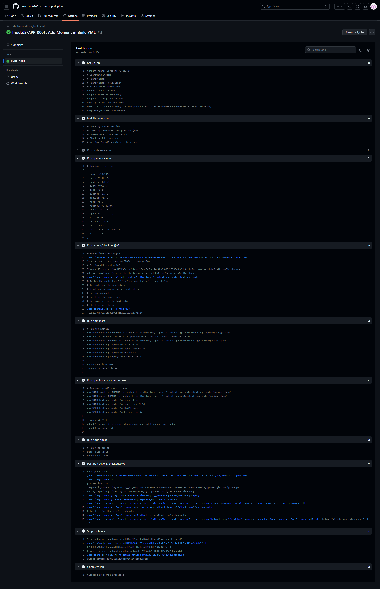

# [test-app-deploy] Deploy in GitHub

## Deployed @ https://rserrano0203.github.io/test-app-deploy/

## Getting started

# Github Deployment

### Step 1: Create github workflow

1. Create folder .github/workflows
2. Create YAML File - build.yml

```yaml
on: push
jobs:
  build-node:
    runs-on: ubuntu-latest
    container: node:14
    steps:
      - run: node --version
      - run: npm -- version
      - uses: actions/checkout@v3
      - run: npm install
      - run: node app.js
```

3. Create package.json File, if already exist no need to create a new one.

```json
{
  "name": "SIMPLE",
  "main": "app.js"
}
```

4. Create app.js File, if already exist no need to create a new one.

```js
console.log("Demo", "Hello World");
var moment = require("moment");
var date = moment().format("LL");
console.log(date);
```

5. Create .gitignore File, if already exist no need to create a new one.

```json
node_modules/
package-lock.json
```

6. Test and run in local.

```bash
npm install --save moment
```

## Screenshot


